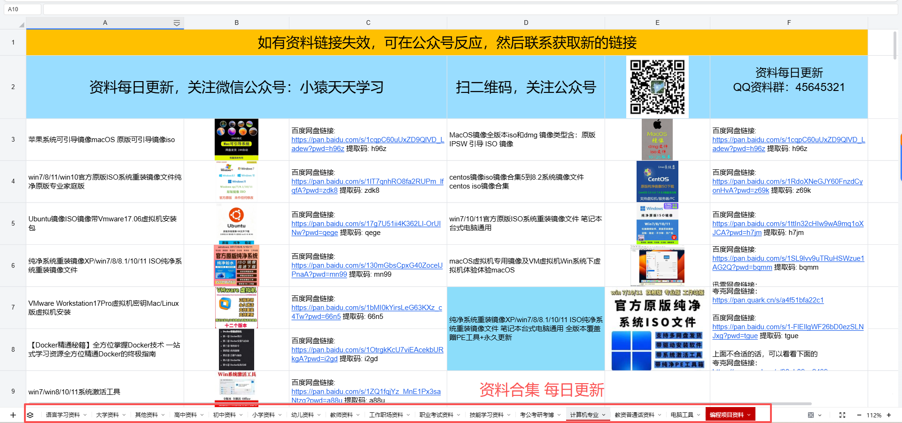

## ISO-GHO

## win7/8/11/镜像 GHO/gho系统重装文件纯净正版专业旗舰版镜像教程

## 资料获取

【腾讯文档】win所有系统资料
https://docs.qq.com/doc/DTGJ3aW9hWFpKcmht

### 资料汇总(每日更新)小初高大学考研考公教资英语日语职场工作电脑工具资料等

链接: https://pan.baidu.com/s/1ydsnxkJexmWMIfKrhCMDzQ?pwd=25nb 提取码: 25nb
--来自百度网盘超级会员v4的分享

### 腾讯文档资料在线更新

https://docs.qq.com/sheet/DTGhyVWRYRFRPRFpO?tab=g4ujf7

### 项目合集(项目不断更新中，包含java、vue、python、Android、微信小程序等项目)

链接: https://pan.baidu.com/s/1nY-zhvAK0CXYcn3g7LzQnQ?pwd=id3c 提取码: id3c
--来自百度网盘超级会员v3的分享

#### 这些项目一起发你了 可以分享给你需要的同学 调试可找我 也接二次修改和项目定制、毕业设计等

通过网盘分享的文件：工具包

链接: https://pan.baidu.com/s/1YmdoJvkjoUjA75wvHLDZ6A?pwd=xm96 提取码: xm96
--来自百度网盘超级会员v3的分享

需要远程项目部署或项目修改和毕业设计也可联系（添加申请时请备注好来意）

通过网盘分享的文件：远程调试部署联系方式

链接: https://pan.baidu.com/s/1W0dDcoZmayG0c7USJDYBYg?pwd=nqd7 提取码: nqd7
--来自百度网盘超级会员v3的分享

### 扫码关注公众号 获取更多项目和编程资料

关注公众号：小猿天天学习

公众号ID：xzzard

## 接毕业设计和论文

微信联系方式：xzxj0206  QQ：3808981644   (支持修改、 部署调试、 支持代做毕设)

选题+开题报告+任务书+程序定制+安装调试+论文+答辩ppt  都可以做

